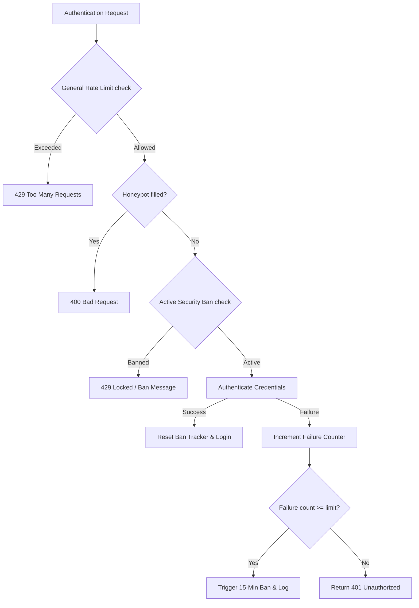

# Authentication Security Hardening (AWorkApp)

This document provides a comprehensive overview of the brute force, anti-bot, and spam prevention mechanisms implemented in AWorkApp to protect the authentication portals (`/login` and `/register`).

---

## 1. Threat Analysis

Web-facing authentication portals are subject to several automated attacks:

1. **Brute Force (Credential Stuffing)**: Attackers test many passwords against a single account or a list of accounts to gain unauthorized access.
2. **User Enumeration**: Attackers verify if email addresses exist by observing response differences (e.g., `404 Not Found` vs `401 Unauthorized` or `409 Conflict`).
3. **Automated Account Registration**: Bots registering fake accounts using temporary/disposable email addresses to consume database resources or find vulnerabilities.
4. **Denial of Service (DoS)**: High volumes of login requests depleting database connection pools or CPU cycles.

---

## 2. Implemented Protections

To combat these threats, a multi-layered security framework has been integrated:



### A. Fail2ban-like Lockout System (`src/models/SecurityBan.ts`, `src/lib/services/security.ts`)

We implemented a database-backed sliding-window failure tracker. Unlike local, in-memory rate limiting (which resets on server restart/cold start in serverless environments), storing bans in MongoDB ensures:

- **Cluster synchronization**: Multi-instance servers share the same ban state.
- **Cold-start persistence**: Bans survive serverless function recycles.

#### Lockout Rules:

1. **IP-wide Lockout**:
   - If an IP address accumulates **5 failed attempts** within a 15-minute window, it is locked out from both logging in and registering for **15 minutes**.
   - Prevents distributed credential stuffing across different emails from a single IP.
2. **Account-wide Lockout**:
   - If a specific email address accumulates **5 failed attempts** across any IP, it is locked out for **15 minutes**.
   - Prevents targeted brute force on a single user's account using rotating proxies.
3. **Mongoose automatic cleanup (TTL)**:
   - To prevent database bloat, an index with a Time-To-Live (TTL) of 24 hours is applied to the tracking records. Any inactive security tracker is automatically purged by MongoDB.

### B. Honeypot Anti-Bot Shield (`src/app/(auth)/login/page.tsx`, `src/app/(auth)/register/page.tsx`)

Many spam bots search forms in the DOM and automatically fill every input field they find.

1. We added an off-screen input named `username_confirm`, hidden from human visual view and screen readers:
   ```html
   <div
     className="absolute -top-[9999px] -left-[9999px] h-0 w-0 overflow-hidden opacity-0"
     aria-hidden="true"
   >
     <input type="text" name="username_confirm" ... />
   </div>
   ```
2. If the API endpoint (`/api/auth/login` or `/api/auth/register`) receives any value in this field, it immediately rejects the request with `400 Bad Request` without querying Mongoose, saving database resources.

### C. Disposable Email Filtering (`src/lib/services/security.ts`)

To prevent automated spam registrations, we validate email addresses against a list of popular temporary/disposable email domains (e.g. `mailinator.com`, `yopmail.com`, `tempmail.com`).

- Registration requests using these domains are blocked instantly with a `400 Bad Request` response.

### D. User Enumeration Hardening (`src/app/api/auth/register/route.ts`)

If a signup attempt is made for an email address that is already registered:

- The route records this as a **failed security attempt** for the requesting IP.
- This blocks scanners that iteratively hit the registration endpoint to map out valid emails.

---

## 3. Configuration & Overrides

These security defaults can be adjusted via environment variables in `.env.local`:

| Variable                              | Description                               | Default |
| :------------------------------------ | :---------------------------------------- | :------ |
| `SECURITY_MAX_IP_FAILURES`            | Max failed logins from an IP before ban   | `5`     |
| `SECURITY_IP_BAN_DURATION_MINUTES`    | IP ban duration in minutes                | `15`    |
| `SECURITY_MAX_EMAIL_FAILURES`         | Max failed logins on an email before lock | `5`     |
| `SECURITY_EMAIL_BAN_DURATION_MINUTES` | Email lockout duration in minutes         | `15`    |

---

## 4. Future Production Recommendations

For high-scale or enterprise deployments, consider implementing:

1. **Cloudflare Turnstile or Google reCAPTCHA**:
   - Integrate a client-side CAPTCHA challenge that activates dynamically after 3 failed attempts, or runs invisibly on signup.
2. **Email Unlock Notifications**:
   - Send a secure email to users whose accounts have been locked, containing a cryptographically signed link allowing them to immediately bypass the lockout.
3. **Upstash Redis Caching**:
   - For extreme traffic, swap the Mongoose-backed `SecurityBan` store for a fast, memory-cache Redis layer using `@upstash/ratelimit`.
